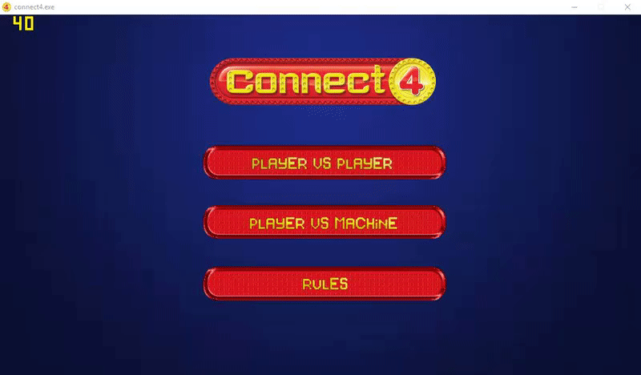

# Connect Four

# About
A game of Connect Four created in C++ with Allegro, implementing an AI based on simple [Minimax](https://en.wikipedia.org/wiki/Minimax) and [Minimax with Alpha-beta pruning](https://en.wikipedia.org/wiki/Alpha–beta_pruning).  

This game was created by [Loukmane Maada](https://github.com/loding1397), [Soukaina Moumou](https://github.com/SoukaM) and [Anas Limouri](https://github.com/EffulgentDusk).  

Some sounds used in the game are originally made by [Chris Kempson](https://github.com/chriskempson) and implemented in his [Connect four version](https://github.com/chriskempson/cpp-connect-four), registered with an MIT License.

# Compiling

Download the [Allegro Library](http://liballeg.org/download.html), extract it to a location on your computer you'll use for storing libraries and add the include, lib and bin directory paths to your project (Code::Blocks for example).

